+-----------------------+-----------------------+-----------------------+
| Niko Leimegger, Pius  | > HWE-Übung           | Franz Lauritsch       |
| Bickel                |                       |                       |
+=======================+=======================+=======================+
+-----------------------+-----------------------+-----------------------+

{width="1.5541666666666667in"
height="0.7333333333333333in"}

> Elektronik und technische Informatik\
> HWE Übungen Semester Projekt\
> Dokumentation zur Projektarbeit
>
> Leslie Speaker\
> **Anfangsdatum: 28.02.2023**\
> **Abgabedatum: 22.06.2023**

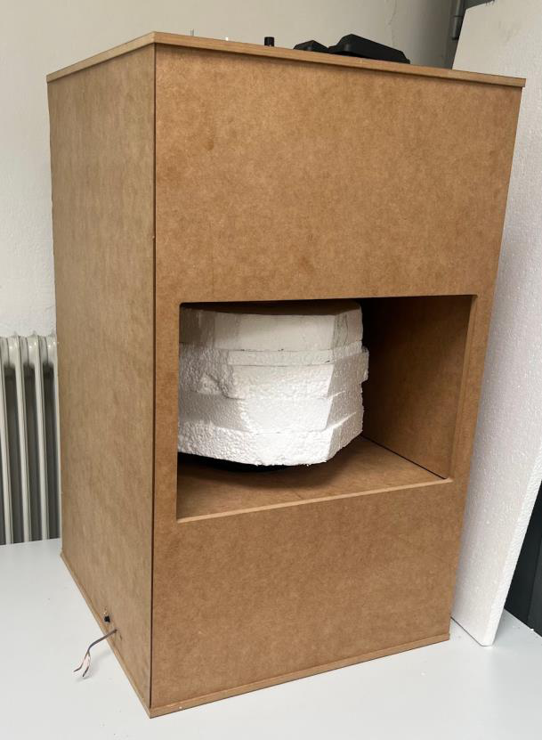{width="3.0458333333333334in"
height="4.158333333333333in"}

> **Projektteam:**\
> Niko Leimegger\
> Pius Bickel\
> **Betreuungslehrer:**\
> Franz Lauritsch
>
> {width="2.7777777777777777in"
> height="0.3055555555555556in"} 1

+-----------------------+-----------------------+-----------------------+
| Niko Leimegger, Pius  | > HWE-Übung           | Franz Lauritsch       |
| Bickel                |                       |                       |
+=======================+=======================+=======================+
+-----------------------+-----------------------+-----------------------+

Inhalt\
Abstract
\...\...\...\...\...\...\...\...\...\...\...\...\...\...\...\...\...\...\...\...\...\...\...\...\...\...\...\...\...\...\...\...\...\...\...\...\...\...\...\...\...\...\...\...\...\...\...\...\...
3 Pflichtenheft:
\...\...\...\...\...\...\...\...\...\...\...\...\...\...\...\...\...\...\...\...\...\...\...\...\...\...\...\...\...\...\...\...\...\...\...\...\...\...\...\...\...\...\...\...\...\...
4 Einleitung
\...\...\...\...\...\...\...\...\...\...\...\...\...\...\...\...\...\...\...\...\...\...\...\...\...\...\...\...\...\...\...\...\...\...\...\...\...\...\...\...\...\...\...\...\...\.....
4 Arbeitsziel:
\...\...\...\...\...\...\...\...\...\...\...\...\...\...\...\...\...\...\...\...\...\...\...\...\...\...\...\...\...\...\...\...\...\...\...\...\...\...\...\...\...\...\...\...\...\...
4 Grobe Technische Einteilung
\...\...\...\...\...\...\...\...\...\...\...\...\...\...\...\...\...\...\...\...\...\...\...\...\...\...\...\...\...\...\...\...\...\...\...\.....
5 Verwendete Entwicklungsoberflächen:
\...\...\...\...\...\...\...\...\...\...\...\...\...\...\...\...\...\...\...\...\...\...\...\...\...\...\...\...\...\...\...\.....
5 Blockschaltbild:
\...\...\...\...\...\...\...\...\...\...\...\...\...\...\...\...\...\...\...\...\...\...\...\...\...\...\...\...\...\...\...\...\...\...\...\...\...\...\...\...\...\...\...\...\...
5 Hardware
\...\...\...\...\...\...\...\...\...\...\...\...\...\...\...\...\...\...\...\...\...\...\...\...\...\...\...\...\...\...\...\...\...\...\...\...\...\...\...\...\...\...\...\...\...\...\...\...
6 BLDC-Ansteuerung
\...\...\...\...\...\...\...\...\...\...\...\...\...\...\...\...\...\...\...\...\...\...\...\...\...\...\...\...\...\...\...\...\...\...\...\...\...\...\...\...\...\...
6 Simulation:
\...\...\...\...\...\...\...\...\...\...\...\...\...\...\...\...\...\...\...\...\...\...\...\...\...\...\...\...\...\...\...\...\...\...\...\...\...\...\...\...\...\...\...\...\...\...
7 Technische Realisierung:
\...\...\...\...\...\...\...\...\...\...\...\...\...\...\...\...\...\...\...\...\...\...\...\...\...\...\...\...\...\...\...\...\...\...\...\...\...\...\...
8 Lautsprecher und Simulation des Resonanzkörpers:
\...\...\...\...\...\...\...\...\...\...\...\...\...\...\...\...\...\...\...\...\...\...\...\.....
8 Lautsprecher:
\...\...\...\...\...\...\...\...\...\...\...\...\...\...\...\...\...\...\...\...\...\...\...\...\...\...\...\...\...\...\...\...\...\...\...\...\...\...\...\...\...\...\....
8 Simulation mit SubSim:
\...\...\...\...\...\...\...\...\...\...\...\...\...\...\...\...\...\...\...\...\...\...\...\...\...\...\...\...\...\...\...\...\...\...\...\...\...\....
9 Verstärker:
\...\...\...\...\...\...\...\...\...\...\...\...\...\...\...\...\...\...\...\...\...\...\...\...\...\...\...\...\...\...\...\...\...\...\...\...\...\...\...\...\...\...\...\...\...\...
9 Vorverstärkung
\...\...\...\...\...\...\...\...\...\...\...\...\...\...\...\...\...\...\...\...\...\...\...\...\...\...\...\...\...\...\...\...\...\...\...\...\...\...\...\...\...\...\...
10 Endstufe
\...\...\...\...\...\...\...\...\...\...\...\...\...\...\...\...\...\...\...\...\...\...\...\...\...\...\...\...\...\...\...\...\...\...\...\...\...\...\...\...\...\...\...\...\...\.....
10 Spannungsversorgung:
\...\...\...\...\...\...\...\...\...\...\...\...\...\...\...\...\...\...\...\...\...\...\...\...\...\...\...\...\...\...\...\...\...\...\...\...\...\...\....
11 Simulation:
\...\...\...\...\...\...\...\...\...\...\...\...\...\...\...\...\...\...\...\...\...\...\...\...\...\...\...\...\...\...\...\...\...\...\...\...\...\...\...\...\...\...\...\...
11 PCB:
\...\...\...\...\...\...\...\...\...\...\...\...\...\...\...\...\...\...\...\...\...\...\...\...\...\...\...\...\...\...\...\...\...\...\...\...\...\...\...\...\...\...\...\...\...\...\.....
12 Footswitch:
\...\...\...\...\...\...\...\...\...\...\...\...\...\...\...\...\...\...\...\...\...\...\...\...\...\...\...\...\...\...\...\...\...\...\...\...\...\...\...\...\...\...\...\...\....
13 Schaltung:
\...\...\...\...\...\...\...\...\...\...\...\...\...\...\...\...\...\...\...\...\...\...\...\...\...\...\...\...\...\...\...\...\...\...\...\...\...\...\...\...\...\...\...\.....
14 PCB:
\...\...\...\...\...\...\...\...\...\...\...\...\...\...\...\...\...\...\...\...\...\...\...\...\...\...\...\...\...\...\...\...\...\...\...\...\...\...\...\...\...\...\...\...\...\...\.....
14
Mechanik\...\...\...\...\...\...\...\...\...\...\...\...\...\...\...\...\...\...\...\...\...\...\...\...\...\...\...\...\...\...\...\...\...\...\...\...\...\...\...\...\...\...\...\...\...\...\.....
15 Gehäuse
\...\...\...\...\...\...\...\...\...\...\...\...\...\...\...\...\...\...\...\...\...\...\...\...\...\...\...\...\...\...\...\...\...\...\...\...\...\...\...\...\...\...\...\...\...\.....
15 Entwicklung
\...\...\...\...\...\...\...\...\...\...\...\...\...\...\...\...\...\...\...\...\...\...\...\...\...\...\...\...\...\...\...\...\...\...\...\...\...\...\...\...\...\...\.....
15 Designs
\...\...\...\...\...\...\...\...\...\...\...\...\...\...\...\...\...\...\...\...\...\...\...\...\...\...\...\...\...\...\...\...\...\...\...\...\...\...\...\...\...\...\...\...\...\...
15 Einzelne Bauteile:
\...\...\...\...\...\...\...\...\...\...\...\...\...\...\...\...\...\...\...\...\...\...\...\...\...\...\...\...\...\...\...\...\...\...\...\...\...\...\...\.....
15
Verbindungsstück\...\...\...\...\...\...\...\...\...\...\...\...\...\...\...\...\...\...\...\...\...\...\...\...\...\...\...\...\...\...\...\...\...\...\...\...\...\...\...\.....
15 Software
\...\...\...\...\...\...\...\...\...\...\...\...\...\...\...\...\...\...\...\...\...\...\...\...\...\...\...\...\...\...\...\...\...\...\...\...\...\...\...\...\...\...\...\...\...\...\...\...
16 Struktogramme:
\...\...\...\...\...\...\...\...\...\...\...\...\...\...\...\...\...\...\...\...\...\...\...\...\...\...\...\...\...\...\...\...\...\...\...\...\...\...\...\...\...\.....
16 Gesamter Code:
\...\...\...\...\...\...\...\...\...\...\...\...\...\...\...\...\...\...\...\...\...\...\...\...\...\...\...\...\...\...\...\...\...\...\...\...\...\...\...\...\...\.....
18 Funktionstest
\...\...\...\...\...\...\...\...\...\...\...\...\...\...\...\...\...\...\...\...\...\...\...\...\...\...\...\...\...\...\...\...\...\...\...\...\...\...\...\...\...\...\...\...
21 Ausgabe am Arduino:
\...\...\...\...\...\...\...\...\...\...\...\...\...\...\...\...\...\...\...\...\...\...\...\...\...\...\...\...\...\...\...\...\...\...\...\...\...\.....
21 Konklusion:
\...\...\...\...\...\...\...\...\...\...\...\...\...\...\...\...\...\...\...\...\...\...\...\...\...\...\...\...\...\...\...\...\...\...\...\...\...\...\...\...\...\...\...\...\...\.....
21

> {width="2.7777777777777777in"
> height="0.3055555555555556in"} 2

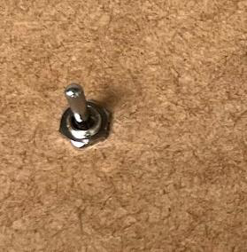{width="1.2916666666666667in"
height="1.3148151793525809in"}

+-----------------------+-----------------------+-----------------------+
| Niko Leimegger, Pius  | > HWE-Übung           | Franz Lauritsch       |
| Bickel                |                       |                       |
+=======================+=======================+=======================+
+-----------------------+-----------------------+-----------------------+

Abstract\
Aktiver / Passiver Lautsprecher für Instrumente und andere Musikquellen,
bei Aktivierung des Motors entsteht ein „Phaser" Effekt.

Der Leslie benötigt eine Betriebsspannung von 12V und mindestens 1A.
Oben am Gehäuse sind 3 Steuerungsmöglichkeiten angebracht.

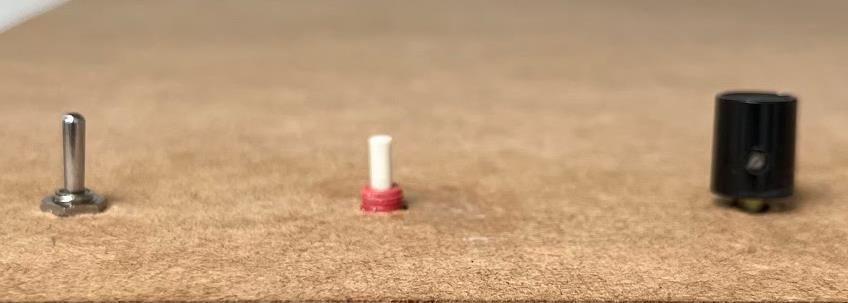{width="3.926388888888889in"
height="1.4027777777777777in"}

*Abbildung 1: Steuermöglichkeiten an Oberseite des Lautsprechers*\
Mit dem Dreiwegeschalter können Sie auswählen welche Signalquelle am
Lautsprecher ausgegeben werden soll. Der Lautsprecher kann damit aktiv
und passiv betrieben werden.

  -----------------------------------------------------------------------
  Passivbetrieb
  -----------------------------------------------------------------------

  -----------------------------------------------------------------------

  -----------------------------------------------------------------------
                          Aus                     
  ----------------------- ----------------------- -----------------------
                          etrieb                  

                                                  
  -----------------------------------------------------------------------

  -----------------------------------------------------------------------
  Aktivbetrieb
  -----------------------------------------------------------------------

  -----------------------------------------------------------------------

*Abbildung 2: Beschrifteter Schalter*\
Mit dem Taster kann der Motor ausgeschalten werden, falls ausschließlich
der Verstärker verwendet werden soll, oder man keine 1A zur Verfügung
hat.

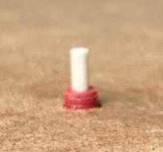{width="0.9347222222222222in"
height="0.875in"}

*Abbildung 3: Taster zur Motorsteuerung*\
Mit dem Drehregler kann die Lautstärke des Verstärkers geregelt werden.

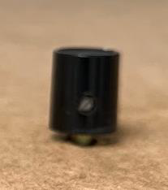{width="0.9583333333333334in"
height="1.0833333333333333in"}

*Abbildung 4: Drehregler für die Lautstärke*

> {width="2.7777777777777777in"
> height="0.3055555555555556in"} 3

+-----------------------+-----------------------+-----------------------+
| Niko Leimegger, Pius  | > HWE-Übung           | Franz Lauritsch       |
| Bickel                |                       |                       |
+=======================+=======================+=======================+
+-----------------------+-----------------------+-----------------------+

Pflichtenheft:

Einleitung\
Ein Leslie Speaker ist ein passiver oder aktiver Lautsprecher, welcher
im Inneren Schall mit Hilfe eines drehenden Objekts ("Cake") lenkt.
Somit wird ein Effekt erzeugt, der in der Audiotechnik „Phaser" genannt
wird. Leslie Speaker wurden früher bei Orgeln eingesetzt und später bei
E-Gitarren. Heute gibt es Software und Digitale Schaltungen, die
denselben Effekt nachahmen.

Beispiele für den Leslie gibt es in folgenden Liedern:

> • Echoes -- Pink Floyd\
> • Something -- The Beatles\
> • Let It Loose -- The Rolling Stones\
> • ...

Im Rahmen des HWE Übungen Unterrichts ist es Ziel, einen solchen
Lautsprecher innerhalb eines Semesters zu realisieren.

Arbeitsziel:\
a.Leslie Cabinet mir variabler Drehfrequenz i.Holzgehäuse\
ii.Styropor „Cake"\
iii.DC-Motor Ansteuern\
iv.Stabile Stromversorgung\
v.Knöpfe oder Potis zum steuern b.Erweiterungsmöglichkeiten\
i.Eingebauter Verstärker\
ii.Display für Systemsteuerung iii.Fußschalter

> {width="2.7777777777777777in"
> height="0.3055555555555556in"} 4

+-----------------------+-----------------------+-----------------------+
| Niko Leimegger, Pius  | > HWE-Übung           | Franz Lauritsch       |
| Bickel                |                       |                       |
+=======================+=======================+=======================+
+-----------------------+-----------------------+-----------------------+

Grobe Technische Einteilung\
c.Hardware\
i.Stromversorgung für µC und Motor\
d.Software\
i.Motor Ansteuerung mit Potentiometer und Knöpfen e.Mechanik\
i.Akustisch angepasstes und Standhaftes Gehäuse Bauen

Verwendete Entwicklungsoberflächen:

+-----------------------------------+-----------------------------------+
| > **Name**                        | > **Version**                     |
+===================================+===================================+
| > EAGLE                           | > 9.6.2                           |
+-----------------------------------+-----------------------------------+
| > LTSpice XVII                    | > 17.0.35.0                       |
+-----------------------------------+-----------------------------------+
| > Word                            | > 2304                            |
+-----------------------------------+-----------------------------------+
| > Excel                           | > 2304                            |
+-----------------------------------+-----------------------------------+
| > subsim.exe (by Isaac MCN)       | http://users.on.net/\~is          |
|                                   | aacmcn/audio/subsim/newsubsim.htm |
+-----------------------------------+-----------------------------------+
| > SolidWorks                      | > 2022-2023                       |
+-----------------------------------+-----------------------------------+
| > Arduino IDE                     | > 2.1.1                           |
+-----------------------------------+-----------------------------------+

Blockschaltbild:

> 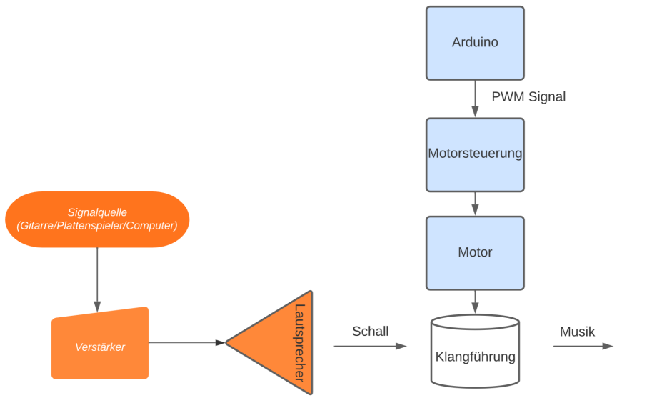{width="4.531943350831146in"
> height="2.7875in"}

*Abbildung 5: Blockschaltbild des ganzen Systems*

Das Signal wird verstärkt und am Lautsprecher ausgegeben. Die
Klangführung, welche durch einen Arduino mit Motorsteuerung angetrieben
wird, erzeugt durch die asymmetrische Form und Drehbewegung den
typischen Leslie-Sound.

> {width="2.7777777777777777in"
> height="0.3055555555555556in"} 5

{width="0.5138888888888888in"
height="0.1527777777777778in"}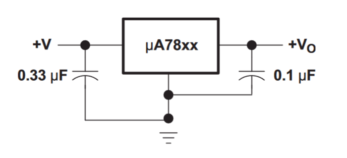{width="3.1847222222222222in"
height="1.4488637357830272in"}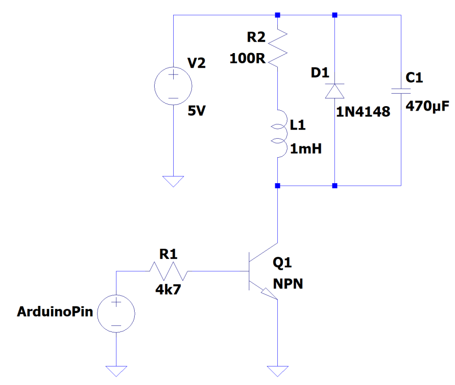{width="4.545833333333333in"
height="3.8457042869641294in"}{width="8.333333333333333e-2in"
height="4.1666666666666664e-2in"}{width="9.722222222222222e-2in"
height="4.1666666666666664e-2in"}{width="0.1111111111111111in"
height="2.7777777777777776e-2in"}{width="0.1111111111111111in"
height="2.7777777777777776e-2in"}{width="0.3194444444444444in"
height="0.125in"}{width="0.16666666666666666in"
height="0.125in"}{width="0.19444444444444445in"
height="0.125in"}

+-----------------------+-----------------------+-----------------------+
| Niko Leimegger, Pius  | > HWE-Übung           | Franz Lauritsch       |
| Bickel                |                       |                       |
+=======================+=======================+=======================+
+-----------------------+-----------------------+-----------------------+

Hardware

BLDC-Ansteuerung\
Anforderungen: Steuerung, um Styroporzylinder schnell und langsam drehen
zu können.

Richtwert: mindestens 60 RPM, maximal 300-400 RPM.

Für den Motor, der die Klangführung rotiert, wird ein BLDC-Motor
verwendet. Die Ansteuerung erfolgt durch eine einfache Transistor
Schaltung, welche mit einem Arduino Nano gesteuert wird. Der Motor
benötigt mindestens einen Duty Cycle von 50%, um ohne Probleme zu
laufen, deshalb wird die Betriebsspannung des Leslies für den Motor
mittels eines 7805 ICs auf 5V geregelt um ihn langsamer laufen lassen zu
können.

*Abbildung 6: Schaltung für den 5V Spannnungsregler*

*Abbildung 7: Schaltung der gesamten Motorsteuerung*

> {width="2.7777777777777777in"
> height="0.3055555555555556in"} 6

{width="5.555555555555555e-2in"
height="5.555555555555555e-2in"}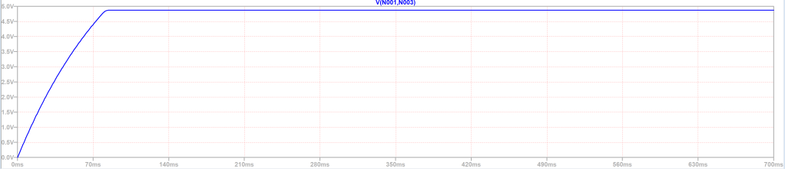{width="5.111111111111111in"
height="1.1052405949256343in"}

+-----------------------+-----------------------+-----------------------+
| Niko Leimegger, Pius  | > HWE-Übung           | Franz Lauritsch       |
| Bickel                |                       |                       |
+=======================+=======================+=======================+
+-----------------------+-----------------------+-----------------------+

Simulation:

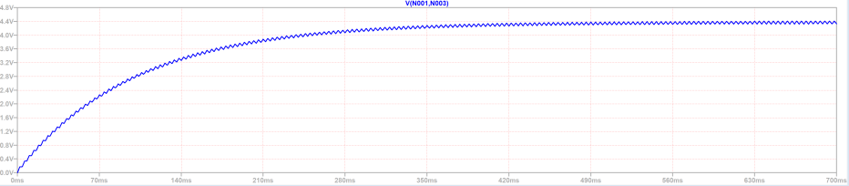{width="4.66388779527559in"
height="1.0222211286089238in"}

*Abbildung 8: Spannung über dem Motor bei Duty Cycle 50%*

Man kann erkennen, dass die Spannung allmählich steigt und dann ein
maximum erreicht. Es ist noch ein leichten Rippel zu erkennen der jedoch
mit einem zusätzlichen Kondensator geglättet werden könnte. In der
Praxis macht dieser Rippel hier keine Probleme.

*Abbildung 9: Spannung über dem Motor bei einem Duty Cycle von 100%*

Bei einem Duty Cycle von 100% steigt die Spannung um einiges schneller
auf das Maximum (die Betriebsspannung).

Für diese simple Schaltung lohnt es sich eine Lochrasterplatine mit
folgendem Layout zu benutzen:

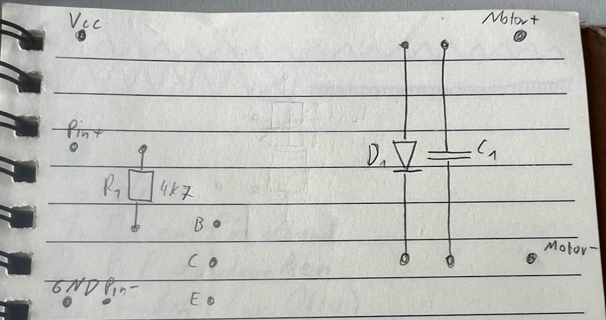{width="6.268054461942257in"
height="3.3208333333333333in"}

*Abbildung 10: Layout der Lochrasterplatine für die Motorsteuerung*

> {width="2.7777777777777777in"
> height="0.3055555555555556in"} 7

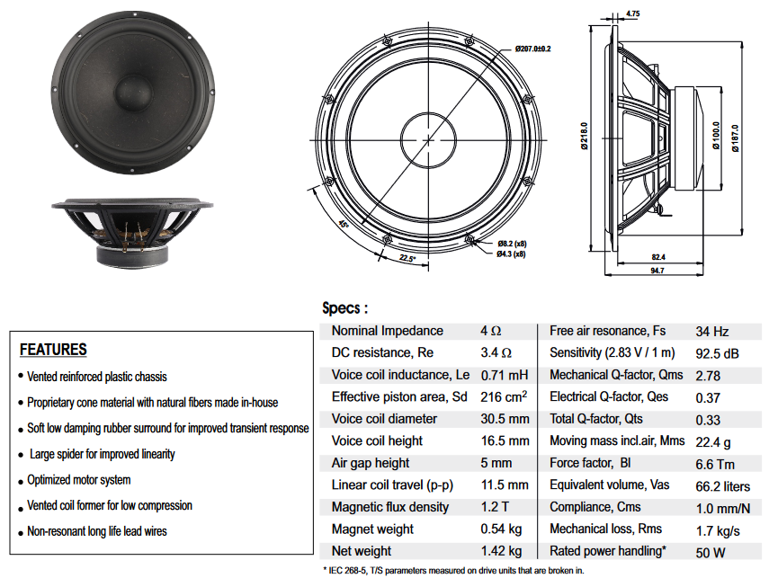{width="3.5680555555555555in"
height="2.725076552930884in"}{width="0.3611111111111111in"
height="0.3611111111111111in"}{width="0.3611111111111111in"
height="0.3611111111111111in"}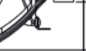{width="0.375in"
height="0.2222222222222222in"}{width="0.1111111111111111in"
height="0.16666666666666666in"}{width="0.1388888888888889in"
height="0.2361111111111111in"}{width="0.1111111111111111in"
height="0.4861111111111111in"}{width="8.333333333333333e-2in"
height="0.4861111111111111in"}{width="0.1388888888888889in"
height="0.19444444444444445in"}{width="0.7222222222222222in"
height="6.944444444444445e-2in"}{width="0.3333333333333333in"
height="9.722222222222222e-2in"}

+-----------------------+-----------------------+-----------------------+
| Niko Leimegger, Pius  | > HWE-Übung           | Franz Lauritsch       |
| Bickel                |                       |                       |
+=======================+=======================+=======================+
+-----------------------+-----------------------+-----------------------+

Technische Realisierung:

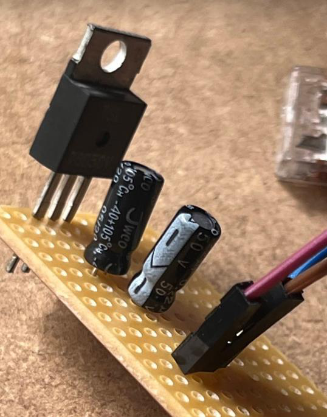{width="2.691666666666667in"
height="3.4277777777777776in"}

*Abbildung 12: Spannungsregelung mittels µA7805*

> 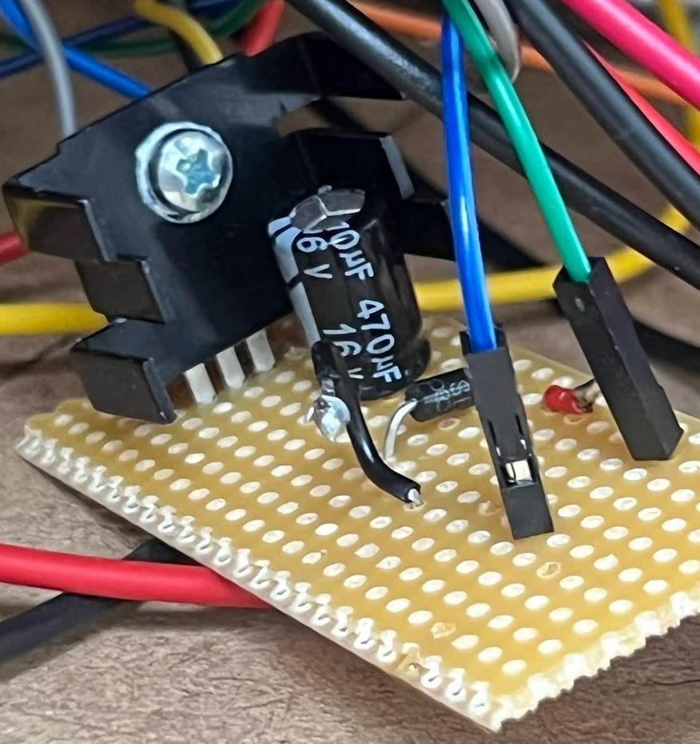{width="3.231943350831146in"
> height="3.4319433508311463in"}
>
> *Abbildung 11: Lochrasterplatine der Motorsteuerung*

Lautsprecher und Simulation des Resonanzkörpers:\
Anforderungen: Niederohmig für maximale Effizienz, ausgerichtet für 20W,
Vollspektrum

Lautsprecher:\
Für Gitarrenverstärker sind 8 Zoll Lautsprecher üblich. Um einen
maximalen Wirkungsgrad des Verstärkers zu erzielen, ist es sinnvoll,
einen niederohmigen Lautsprecher zu benutzen wie hier mit einer Impedanz
von 4 Ohm.

> {width="0.7222222222222222in"
> height="8.333333333333333e-2in"}
>
> {width="1.2361111111111112in"
> height="8.333333333333333e-2in"}
>
> {width="0.75in"
> height="8.333333333333333e-2in"}
>
> {width="0.5555555555555556in"
> height="8.333333333333333e-2in"}
>
> {width="0.8333333333333334in"
> height="8.333333333333333e-2in"}

*Abbildung 13: Datenblatt des Lautsprechers*

> {width="2.7777777777777777in"
> height="0.3055555555555556in"} 8

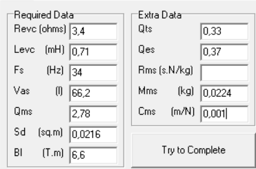{width="2.6861100174978128in"
height="1.7810859580052494in"}{width="6.944444444444445e-2in"
height="0.1111111111111111in"}{width="4.1666666666666664e-2in"
height="4.1666666666666664e-2in"}{width="4.1666666666666664e-2in"
height="4.1666666666666664e-2in"}{width="4.1666666666666664e-2in"
height="6.944444444444445e-2in"}{width="0.1111111111111111in"
height="4.1666666666666664e-2in"}{width="6.944444444444445e-2in"
height="4.1666666666666664e-2in"}{width="9.722222222222222e-2in"
height="0.1111111111111111in"}{width="5.555555555555555e-2in"
height="4.1666666666666664e-2in"}{width="4.1666666666666664e-2in"
height="4.1666666666666664e-2in"}{width="4.1666666666666664e-2in"
height="4.1666666666666664e-2in"}{width="4.1666666666666664e-2in"
height="4.1666666666666664e-2in"}{width="4.1666666666666664e-2in"
height="4.1666666666666664e-2in"}{width="4.1666666666666664e-2in"
height="4.1666666666666664e-2in"}{width="5.555555555555555e-2in"
height="4.1666666666666664e-2in"}{width="4.1666666666666664e-2in"
height="4.1666666666666664e-2in"}{width="5.555555555555555e-2in"
height="5.555555555555555e-2in"}{width="4.1666666666666664e-2in"
height="4.1666666666666664e-2in"}{width="6.944444444444445e-2in"
height="9.722222222222222e-2in"}{width="4.1666666666666664e-2in"
height="4.1666666666666664e-2in"}{width="4.1666666666666664e-2in"
height="4.1666666666666664e-2in"}{width="4.1666666666666664e-2in"
height="5.555555555555555e-2in"}{width="5.555555555555555e-2in"
height="4.1666666666666664e-2in"}{width="4.1666666666666664e-2in"
height="4.1666666666666664e-2in"}{width="4.1666666666666664e-2in"
height="4.1666666666666664e-2in"}{width="4.1666666666666664e-2in"
height="6.944444444444445e-2in"}{width="4.1666666666666664e-2in"
height="5.555555555555555e-2in"}{width="5.555555555555555e-2in"
height="6.944444444444445e-2in"}{width="5.555555555555555e-2in"
height="4.1666666666666664e-2in"}{width="4.1666666666666664e-2in"
height="5.555555555555555e-2in"}{width="6.944444444444445e-2in"
height="9.722222222222222e-2in"}

+-----------------------+-----------------------+-----------------------+
| Niko Leimegger, Pius  | > HWE-Übung           | Franz Lauritsch       |
| Bickel                |                       |                       |
+=======================+=======================+=======================+
+-----------------------+-----------------------+-----------------------+

Simulation mit SubSim:\
Um das Verhalten des Lautsprechers zu simulieren, kann ein Subwoofer
Simulationsprogramm wie Subsim verwendet werden.

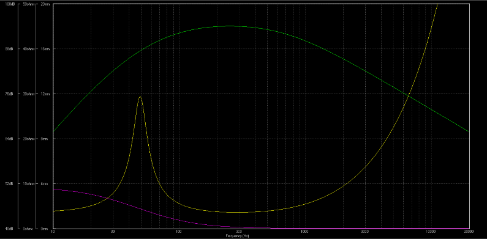{width="3.6166666666666667in"
height="1.7777777777777777in"}

*Abbildung 14: Simulationsparameter* *Abbildung 15: Simulationsergebnis*

In Grün erkennt man das Frequenzverhalten des Lautsprechers im Leslie
inklusive Resonanzkörper. In Gelb kann man die Impedanz des
Lautsprechers erkennen. Man sieht, dass der Widerstand bei der
Resonanzfrequenz ein peak aufzeigt und ab \~2000Hz stetig steigt. In
Rosa kann man die Phase der Impedanz erkennen.

Zusammengefasst kann man feststellen, dass der gewählte Lautsprecher für
Musik geeignet ist, denn er dämpft nur im sehr tiefen Bass Bereich und
im Hohen Frequenzbereich

Verstärker:\
Um den Lautsprecher auch aktiv betrieben zu können muss ein Verstärker
eingebaut werden. Hier lohnt sich ein Klasse AB-Verstärker, denn er
bietet einen Kompromiss zwischen Klangreinheit, Effizienz und
Komplexität. Der Verstärker besteht aus mehreren Stufen:

{width="6.268054461942257in"
height="0.3902777777777778in"}

*Abbildung 16: Blockschaltbild des Verstärkers*

> {width="2.7777777777777777in"
> height="0.3055555555555556in"} 9

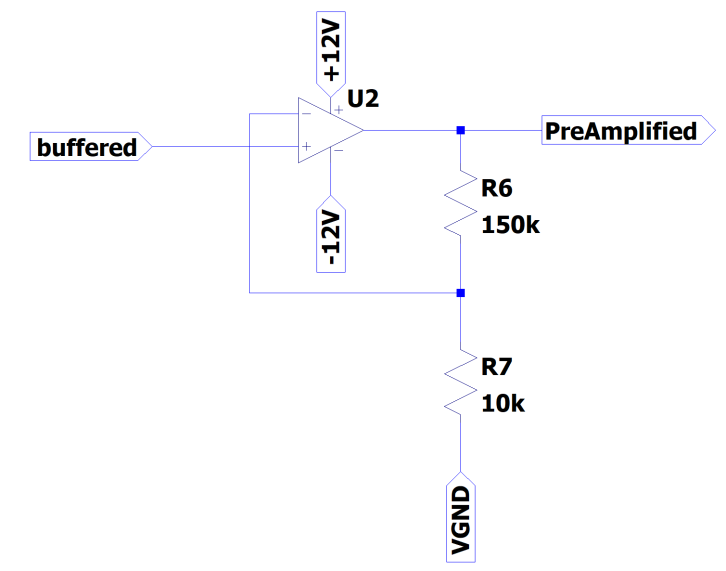{width="3.6347222222222224in"
height="2.8587139107611548in"}{width="5.555555555555555e-2in"
height="4.1666666666666664e-2in"}{width="5.555555555555555e-2in"
height="4.1666666666666664e-2in"}{width="0.1388888888888889in"
height="0.1111111111111111in"}{width="9.722222222222222e-2in"
height="6.944444444444445e-2in"}{width="4.1666666666666664e-2in"
height="4.1666666666666664e-2in"}{width="5.555555555555555e-2in"
height="4.1666666666666664e-2in"}{width="5.555555555555555e-2in"
height="4.1666666666666664e-2in"}{width="0.125in"
height="9.722222222222222e-2in"}{width="6.944444444444445e-2in"
height="6.944444444444445e-2in"}{width="5.555555555555555e-2in"
height="4.1666666666666664e-2in"}{width="4.1666666666666664e-2in"
height="4.1666666666666664e-2in"}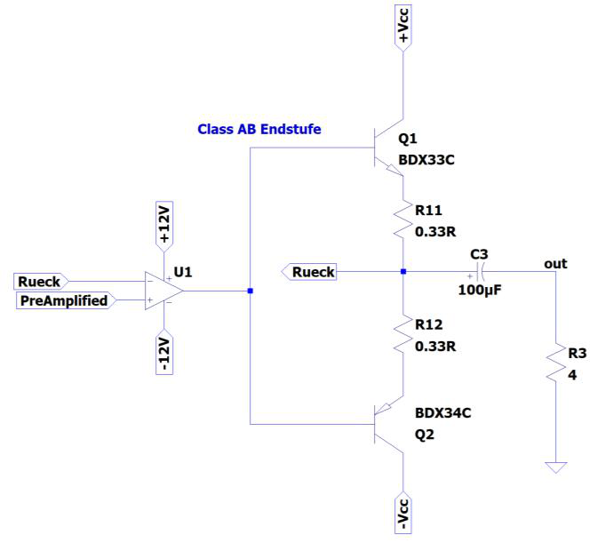{width="3.4069444444444446in"
height="3.0567443132108485in"}{width="4.1666666666666664e-2in"
height="4.1666666666666664e-2in"}{width="0.3333333333333333in"
height="4.1666666666666664e-2in"}

+-----------------------+-----------------------+-----------------------+
| Niko Leimegger, Pius  | > HWE-Übung           | Franz Lauritsch       |
| Bickel                |                       |                       |
+=======================+=======================+=======================+
+-----------------------+-----------------------+-----------------------+

Vorverstärkung\
Das Signal (Amplitude: Gitarrensignal \<50mV, Aux (\~500mV-1V)) wird
vorverstärkt damit die Lautstärke eingestellt werden kann. Dies wird mit
einer einfachen OP-Schaltung (Nicht\
invertierender Verstärker) bewirkt. Um von 0.5V auf maximal 10V zu
kommen, benötigen wir eine Verstärkung von 20. R6 wäre als Potentiometer
verbaut

*Abbildung 17: Schaltung des Vorverstärkers*

Endstufe

*Abbildung 18: Klasse AB-Endstufe mit OP*

Die Endstufe besteht aus einem Operationsverstärker und einer
„Push-Pull" Transistor\
Konfiguration. Der OP regelt seinen Ausgang so, dass am Ausgang ein fast
unverzerrtes Signal, erzeugt wird. Der NPN-Transistor verstärkt die
positive halbwelle, der PNP die negative. R11 und R12 sollen den Strom
bei hohen Temperaturen stabilisieren. Optional könnte man noch Dioden
ober und unter dem Ausgang des OPs dazuschalten, jedoch hat dies in
unserem Fall zu Übersteuerung und unnötigen Problemen geführt. Außerdem
können Basiswiderstände zur Verbesserung des

> {width="2.7777777777777777in"
> height="0.3055555555555556in"} 10

{width="0.3194444444444444in"
height="0.1527777777777778in"}{width="0.2222222222222222in"
height="0.1388888888888889in"}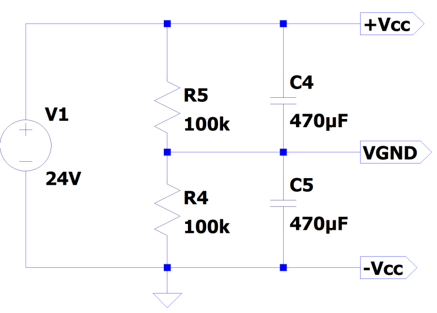{width="3.7222222222222223in"
height="2.671594488188976in"}{width="5.555555555555555e-2in"
height="5.555555555555555e-2in"}{width="4.1666666666666664e-2in"
height="4.1666666666666664e-2in"}{width="5.555555555555555e-2in"
height="4.1666666666666664e-2in"}{width="5.555555555555555e-2in"
height="6.944444444444445e-2in"}{width="9.722222222222222e-2in"
height="9.722222222222222e-2in"}{width="6.944444444444445e-2in"
height="0.1111111111111111in"}{width="5.555555555555555e-2in"
height="6.944444444444445e-2in"}{width="4.1666666666666664e-2in"
height="5.555555555555555e-2in"}{width="4.1666666666666664e-2in"
height="5.555555555555555e-2in"}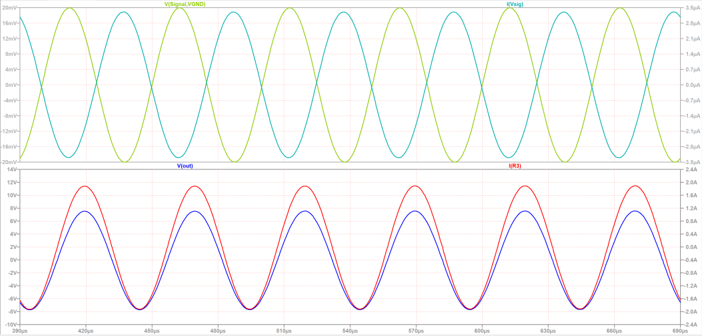{width="5.270833333333333in"
height="2.5304002624671917in"}{width="0.125in"
height="6.944444444444445e-2in"}{width="0.1111111111111111in"
height="6.944444444444445e-2in"}{width="4.1666666666666664e-2in"
height="5.555555555555555e-2in"}{width="0.125in"
height="6.944444444444445e-2in"}{width="0.125in"
height="6.944444444444445e-2in"}{width="6.944444444444445e-2in"
height="6.944444444444445e-2in"}{width="9.722222222222222e-2in"
height="8.333333333333333e-2in"}{width="4.1666666666666664e-2in"
height="4.1666666666666664e-2in"}{width="0.1388888888888889in"
height="8.333333333333333e-2in"}{width="0.125in"
height="8.333333333333333e-2in"}{width="4.1666666666666664e-2in"
height="4.1666666666666664e-2in"}{width="9.722222222222222e-2in"
height="8.333333333333333e-2in"}{width="4.1666666666666664e-2in"
height="4.1666666666666664e-2in"}{width="0.125in"
height="8.333333333333333e-2in"}{width="0.125in"
height="8.333333333333333e-2in"}{width="4.1666666666666664e-2in"
height="4.1666666666666664e-2in"}{width="0.1111111111111111in"
height="8.333333333333333e-2in"}{width="4.1666666666666664e-2in"
height="5.555555555555555e-2in"}{width="0.1388888888888889in"
height="8.333333333333333e-2in"}{width="0.125in"
height="8.333333333333333e-2in"}{width="0.125in"
height="8.333333333333333e-2in"}{width="0.125in"
height="8.333333333333333e-2in"}{width="0.1388888888888889in"
height="8.333333333333333e-2in"}

+-----------------------+-----------------------+-----------------------+
| Niko Leimegger, Pius  | > HWE-Übung           | Franz Lauritsch       |
| Bickel                |                       |                       |
+=======================+=======================+=======================+
+-----------------------+-----------------------+-----------------------+

Arbeitspunktes dazugeschaltet werden. Diese haben ebenfalls zu unnötigen
Problemen geführt, deshalb haben wir uns für dieses Design entschieden.
Das Signal wird dann über einen Kondensator, der den DC-Anteil im Signal
filtert am 4 Ohm Lautsprecher ausgegeben. Der Nachteil des
AB-Verstärkers ist der hohe Ruhestrom. Er ist zwar kleiner als beim
A-Verstärker jedoch liegt er beim Verbauten Transistor bei 𝐼𝑟𝑢ℎ𝑒 =
\~10𝑚𝐴.

Spannungsversorgung:

*Abbildung 19: Schaltung der Spannungsversorgung*

Für den OP und die Endstufe werden minus Spannungen benötigt. Diese
erzeugen wir mit einem einfachen Spannungsteiler. Dieser Ansatz ist
nicht ideal, für unsere Anwendung jedoch ausreichend.

Wenn man den Punkt zwischen den Widerständen als Ground für die
Schaltung definiert, ist der wirkliche Ground als -Vcc anzusehen.

Die Kondensatoren dienen als einfache Glättungsfilter.

Simulation:\
Eingangssignal: 20mV (Typisch für manche Tonabnehmer von E-Gitarren),
20kHz

{width="5.555555555555555e-2in"
height="4.1666666666666664e-2in"}

*Abbildung 13: LTSpice Simulation des Verstärkers*

Obwohl eine leichte Phasenverschiebung zu erkennen ist, sieht man, dass
die Spannung und der Strom des Signals verstärkt wurden.

> {width="2.7777777777777777in"
> height="0.3055555555555556in"} 11

+-----------------------+-----------------------+-----------------------+
| Niko Leimegger, Pius  | > HWE-Übung           | Franz Lauritsch       |
| Bickel                |                       |                       |
+=======================+=======================+=======================+
+-----------------------+-----------------------+-----------------------+

PCB:\
Bei Audioanwendungen ist es ratsam, eine Platine zu erstellen:

D1, D2, R3, R4 und C4 sind optional zu bestücken, jedoch müssen die
Dioden D1 und D2 mit einem Draht überbrückt werden. C4 wäre dafür da
einen Tiefpass zu realisieren, falls hochfrequente Störungen am
Lautsprecher stören würden.

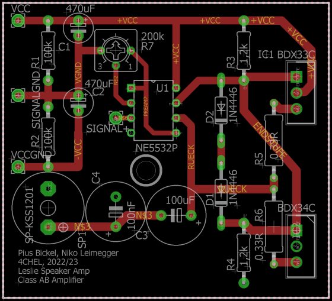{width="2.804165573053368in"
height="2.5499989063867017in"}

*Abbildung 14: Layout der Platine*

Im Nachhinein sind folgende Punkte zu verbessern:

> • Widerstände R5 und R6 weiter weg von den größten Wärmeerzeugern
> (BDX33C, BDX34C) • Größeres Package für R7\
> • Größeres Package für C1 und C2

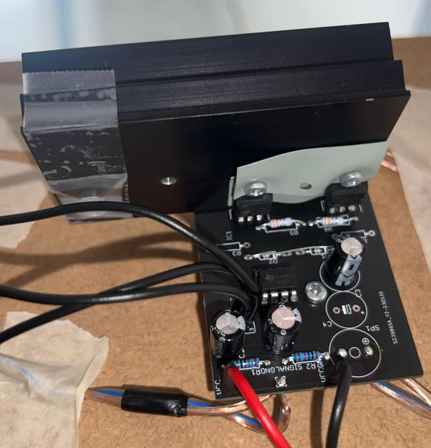{width="3.138888888888889in"
height="3.265277777777778in"}

*Abbildung 20: eingebaute und bestückte Platine*

> {width="2.7777777777777777in"
> height="0.3055555555555556in"} 12

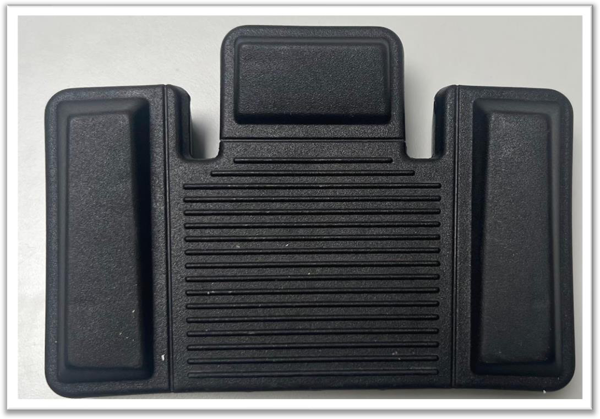{width="5.445833333333334in"
height="3.802090988626422in"}{width="1.5in"
height="0.3472222222222222in"}{width="1.5138888888888888in"
height="0.3472222222222222in"}

+-----------------------+-----------------------+-----------------------+
| Niko Leimegger, Pius  | > HWE-Übung           | Franz Lauritsch       |
| Bickel                |                       |                       |
+=======================+=======================+=======================+
+-----------------------+-----------------------+-----------------------+

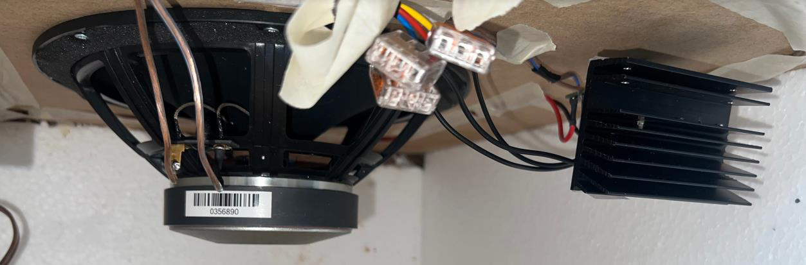{width="6.268054461942257in"
height="2.066666666666667in"}

*Abbildung 21: Aufbau der unteren Kammer*

Footswitch:

+-----------------------+-----------------------+-----------------------+
|   ------------------  |   ------------------  | +------------------+  |
|   Taster 1 :          |                       | | > Taster 3 :     |  |
|   Langsamer           |   ------------------  | | > Schneller      |  |
|   ------------------  |                       | +==================+  |
|                       |                       | +------------------+  |
|   ------------------  |                       |                       |
+=======================+=======================+=======================+
|   ------------------  |                       |   ------------------  |
|                       |                       |                       |
|   ------------------  |                       |   ------------------  |
+-----------------------+-----------------------+-----------------------+
|                       | +------------------+  |                       |
|                       | | > Taster 2 : Ein |  |                       |
|                       | | > / Aus          |  |                       |
|                       | +==================+  |                       |
|                       | +------------------+  |                       |
+-----------------------+-----------------------+-----------------------+

*Abbildung 8 Footswitch mit Taster Beschriftung*

Um den Motor auch während dem Gitarre spielen bedienbar zu gestalten,
kann ein Fußschalter

angebracht werden.

+-----------------------------------+-----------------------------------+
| {width="2.7777777777777777in" |                                   |
| height="0.3055555555555556in"}    |                                   |
+===================================+===================================+
+-----------------------------------+-----------------------------------+

+-----------------------+-----------------------+-----------------------+
| Niko Leimegger, Pius  | > HWE-Übung           | Franz Lauritsch       |
| Bickel                |                       |                       |
+=======================+=======================+=======================+
+-----------------------+-----------------------+-----------------------+

Schaltung:

Um die einzelnen Switches einfach mit dem Arduino ansprechen zu können,
war es hilfreich eine

neue Platine zu designen, als den internen Bus abzufragen. Die Schaltung
leitet lediglich einen Pin

auf alle anderen und somit kann man abfragen welcher Pin z.B. an Vcc
anliegt.

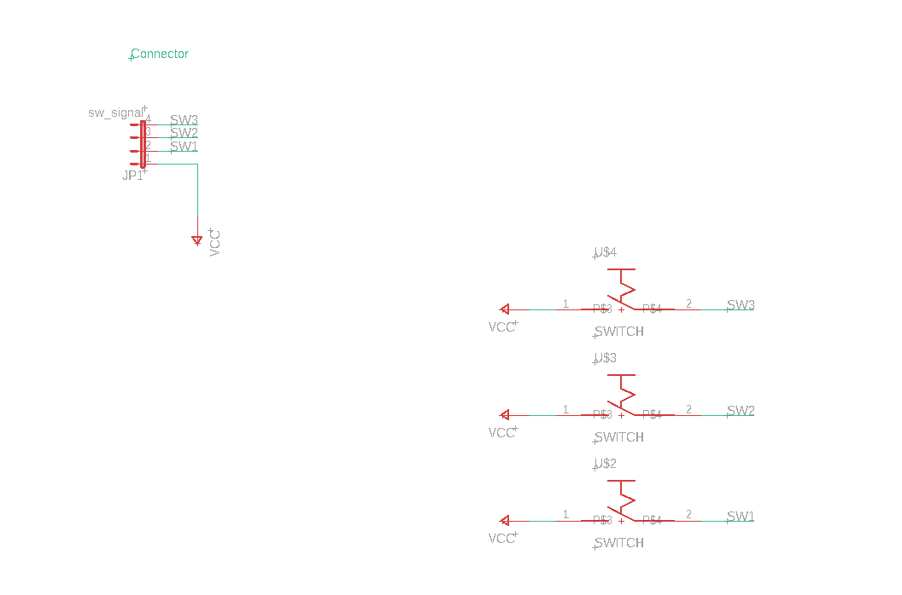{width="4.420833333333333in"
height="2.9208333333333334in"}

*Abbildung 9 Schaltplan der Verbindungsplatine im Footswitch*

PCB:

{width="3.6902777777777778in"
height="3.5249989063867018in"}

*Abbildung 10 Boardplan der Verbindungsplatine*

> {width="2.7777777777777777in"
> height="0.3055555555555556in"} 14

+-----------------------+-----------------------+-----------------------+
| Niko Leimegger, Pius  | > HWE-Übung           | Franz Lauritsch       |
| Bickel                |                       |                       |
+=======================+=======================+=======================+
+-----------------------+-----------------------+-----------------------+

Mechanik

Gehäuse\
Anforderungen: 3 Kammern, Stabil, akustisch fördernde Eigenschaften

Entwicklung\
Das Gehäuse besteht aus 3 Kammern, in der obersten Kammer befindet sich
die Motorsteuerung, im mittleren der aus Styropor hergestellte „Cake",
und im untersten Abteil der Verstärker und Lautsprecher.

Designs\
Das Ganze Gehäuse hat Außenmaße von 800mm \* 500mm \* 500mm, und eine
Wandstärke von 12mm.

Einzelne Bauteile:

+-----------------------+-----------------------+-----------------------+
| {width=" | image134.png){width=" | image135.png){width=" |
| 2.1333333333333333in" | 1.9236111111111112in" | 1.6347211286089238in" |
| height="2             | height="2             | > height="2           |
| .3902766841644794in"} | .4527766841644794in"} | .4791666666666665in"} |
+=======================+=======================+=======================+
| *Abbildung 24:        | > *Abbildung 23:      | > *Abbildung 22:      |
| Gesamtkonstrukt*      | > Seitenwände mit*    | > Frontplatte mit*    |
+-----------------------+-----------------------+-----------------------+
|                       | > *Fräsung*           | > *Loch für Schall*   |
+-----------------------+-----------------------+-----------------------+

Die Ober- und Unterplatte sowie die Zwischenböden wurden nach dem
Zusammenbau korrekt zugeschnitten.

Verbindungsstück

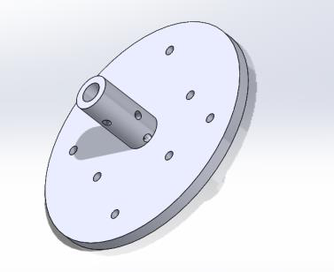{width="1.886111111111111in"
height="1.5416666666666667in"}

*Abbildung 25: Verbindungsteil zwischen Motor und Klangführung*

Nachdem Leim allein keine ausreichend starke Verbindung zwischen Metall
(Rotor) und Styropor herstellen kann, wird per 3D Druck ein Adapter
gefertigt, der mittels Schrauben und Leim festgemacht ist, und am Rotor
ausschließlich durch Reibung festgehalten wird.

Bei einer zweiten Version wäre es sinnvoll, den Halter vom Rotor zu
stützen damit die Fliehkräfte weniger Auswirkung auf die Drehbewegung
haben.

> {width="2.7777777777777777in"
> height="0.3055555555555556in"} 15

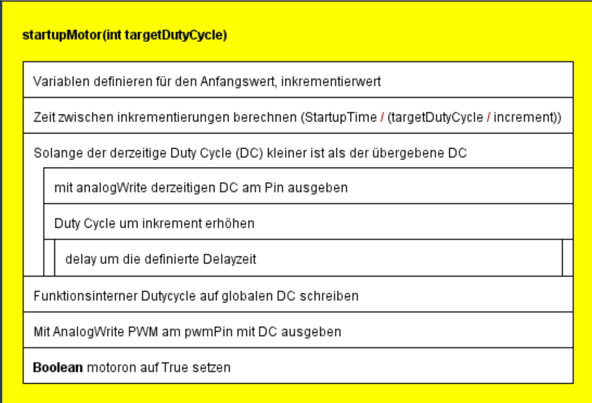{width="4.523611111111111in"
height="3.0832753718285213in"}{width="6.944444444444445e-2in"
height="0.2777777777777778in"}{width="3.888888888888889in"
height="0.2777777777777778in"}{width="8.333333333333333e-2in"
height="0.2777777777777778in"}{width="4.055555555555555in"
height="0.2638888888888889in"}{width="4.055555555555555in"
height="0.2638888888888889in"}{width="0.3055555555555556in"
height="9.722222222222222e-2in"}{width="0.3888888888888889in"
height="9.722222222222222e-2in"}{width="0.3888888888888889in"
height="9.722222222222222e-2in"}{width="0.3888888888888889in"
height="9.722222222222222e-2in"}{width="0.1527777777777778in"
height="8.333333333333333e-2in"}{width="0.4722222222222222in"
height="0.1111111111111111in"}{width="0.3333333333333333in"
height="9.722222222222222e-2in"}{width="0.3888888888888889in"
height="0.1111111111111111in"}{width="0.25in"
height="9.722222222222222e-2in"}{width="0.4722222222222222in"
height="9.722222222222222e-2in"}{width="0.16666666666666666in"
height="9.722222222222222e-2in"}{width="0.5694444444444444in"
height="0.1111111111111111in"}{width="0.4305555555555556in"
height="0.1111111111111111in"}{width="0.1527777777777778in"
height="9.722222222222222e-2in"}{width="0.7361111111111112in"
height="0.1111111111111111in"}{width="0.1388888888888889in"
height="9.722222222222222e-2in"}{width="0.125in"
height="9.722222222222222e-2in"}{width="0.3194444444444444in"
height="9.722222222222222e-2in"}{width="0.2222222222222222in"
height="0.1111111111111111in"}{width="0.2638888888888889in"
height="0.1111111111111111in"}{width="0.20833333333333334in"
height="0.1111111111111111in"}{width="0.4583333333333333in"
height="0.1111111111111111in"}{width="0.1527777777777778in"
height="9.722222222222222e-2in"}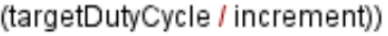{width="1.3472222222222223in"
height="0.125in"}{width="0.6527777777777778in"
height="0.1111111111111111in"}{width="0.5in"
height="9.722222222222222e-2in"}{width="0.875in"
height="0.125in"}{width="0.7777777777777778in"
height="0.1111111111111111in"}{width="0.6111111111111112in"
height="0.125in"}{width="0.18055555555555555in"
height="0.1111111111111111in"}{width="0.6111111111111112in"
height="0.1111111111111111in"}{width="0.4583333333333333in"
height="0.1111111111111111in"}

+-----------------------+-----------------------+-----------------------+
| Niko Leimegger, Pius  | > HWE-Übung           | Franz Lauritsch       |
| Bickel                |                       |                       |
+=======================+=======================+=======================+
+-----------------------+-----------------------+-----------------------+

*Fertiges Gehäuse*

+-----------------------+-----------------------+-----------------------+
| {width=" | image138.png){width=" | image139.png){width=" |
| 1.5819444444444444in" | 1.4152766841644795in" | 1.8055555555555556in" |
| height="2             | height="              | > height="2           |
| .5166666666666666in"} | 2.515277777777778in"} | .5277777777777777in"} |
+=======================+=======================+=======================+
+-----------------------+-----------------------+-----------------------+

> 1.Das Gehäuse ohne Klangführung und Frontplatte\
> 2.Gehäuse inklusive Klangführung und provisorischer Styropordichtung
> 3.Fertiges Gehäuse

Die Tonkammer für den Lautsprecher wurde mit Styropor abgedichtet, um
einen besseren Klang zu realisieren.

Software\
Anforderungen: Motor PWM steuern, Taster abfragen.

Eigentlich war für dieses Projekt eine MEGACARD vorhergesehen, durch
Schwierigkeiten in der permanenten Beschaffung einer MEGACARD hat sich
ein Arduino Nano als ökonomischer herauskristallisiert.

Software geschrieben in der Arduino IDE

Struktogramme:

> {width="0.625in"
> height="9.722222222222222e-2in"}
>
> {width="0.3888888888888889in"
> height="0.1111111111111111in"}
>
> {width="0.8194444444444444in"
> height="9.722222222222222e-2in"}
>
> {width="0.7083333333333334in"
> height="0.1111111111111111in"}

*Abbildung 12 Struktogramm der Motor-Startup-Routine*

> {width="2.7777777777777777in"
> height="0.3055555555555556in"} 16

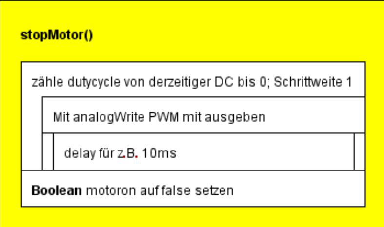{width="4.106944444444444in"
height="2.4318121172353457in"}{width="5.555555555555555e-2in"
height="4.1666666666666664e-2in"}{width="4.1666666666666664e-2in"
height="0.3611111111111111in"}{width="0.1111111111111111in"
height="0.375in"}{width="3.2222222222222223in"
height="0.375in"}{width="8.333333333333333e-2in"
height="0.375in"}{width="5.555555555555555e-2in"
height="4.1666666666666664e-2in"}{width="3.4583333333333335in"
height="0.375in"}{width="0.4305555555555556in"
height="0.16666666666666666in"}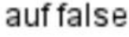{width="0.5694444444444444in"
height="0.16666666666666666in"}{width="0.5555555555555556in"
height="0.16666666666666666in"}{width="0.5555555555555556in"
height="0.16666666666666666in"}{width="0.8472222222222222in"
height="0.16666666666666666in"}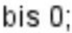{width="0.3611111111111111in"
height="0.16666666666666666in"}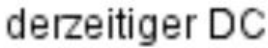{width="0.9305555555555556in"
height="0.16666666666666666in"}{width="1.2222222222222223in"
height="0.16666666666666666in"}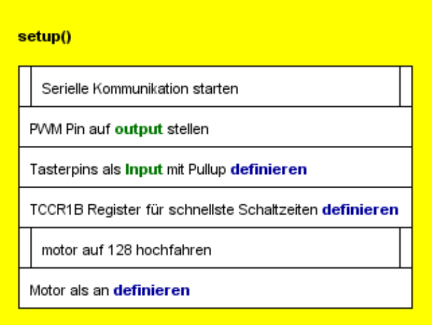{width="3.486111111111111in"
height="2.626654636920385in"}{width="0.1388888888888889in"
height="9.722222222222222e-2in"}{width="0.16666666666666666in"
height="0.1111111111111111in"}{width="0.3055555555555556in"
height="0.1111111111111111in"}{width="0.6388888888888888in"
height="0.125in"}{width="0.625in"
height="0.1111111111111111in"}{width="0.4305555555555556in"
height="0.1111111111111111in"}{width="0.3055555555555556in"
height="0.1111111111111111in"}{width="0.6388888888888888in"
height="0.125in"}{width="0.6527777777777778in"
height="0.125in"}{width="0.5416666666666666in"
height="0.125in"}{width="0.16666666666666666in"
height="0.125in"}{width="0.4444444444444444in"
height="0.1388888888888889in"}{width="8.333333333333333e-2in"
height="0.125in"}{width="0.6388888888888888in"
height="0.1111111111111111in"}{width="0.3333333333333333in"
height="0.125in"}{width="0.1527777777777778in"
height="0.1111111111111111in"}{width="0.3194444444444444in"
height="0.125in"}{width="0.16666666666666666in"
height="0.1111111111111111in"}{width="0.3472222222222222in"
height="0.1111111111111111in"}{width="0.4166666666666667in"
height="0.1388888888888889in"}{width="0.20833333333333334in"
height="0.1111111111111111in"}{width="0.16666666666666666in"
height="0.1111111111111111in"}{width="0.3888888888888889in"
height="0.1111111111111111in"}{width="0.7916666666666666in"
height="0.1111111111111111in"}{width="0.3888888888888889in"
height="0.1111111111111111in"}

+-----------------------+-----------------------+-----------------------+
| Niko Leimegger, Pius  | > HWE-Übung           | Franz Lauritsch       |
| Bickel                |                       |                       |
+=======================+=======================+=======================+
+-----------------------+-----------------------+-----------------------+

*Abbildung 13 Struktogramm der Motor-Stopp-Routine*

{width="0.2777777777777778in"
height="0.1111111111111111in"}

{width="0.5694444444444444in"
height="0.125in"}

{width="0.3472222222222222in"
height="0.125in"}

*Abbildung 26: Struktogramm für die Setup Funktion*

> {width="2.7777777777777777in"
> height="0.3055555555555556in"} 17

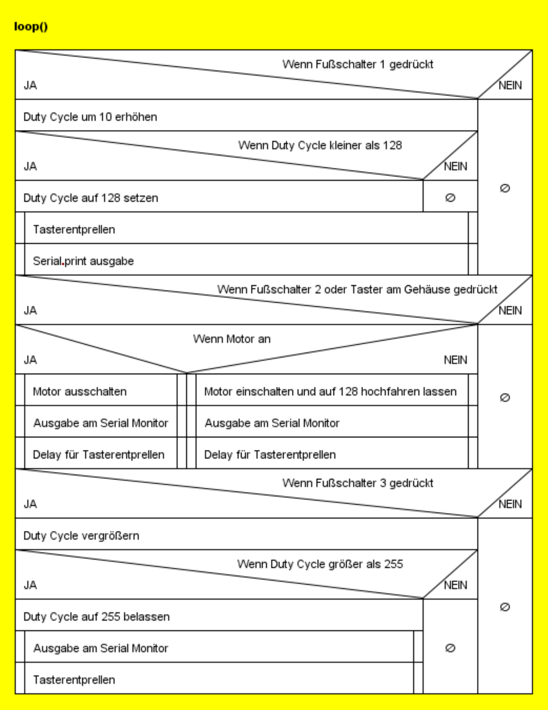{width="4.795833333333333in"
height="6.206372484689414in"}{width="4.1666666666666664e-2in"
height="5.555555555555555e-2in"}{width="4.1666666666666664e-2in"
height="5.555555555555555e-2in"}{width="4.1666666666666664e-2in"
height="4.1666666666666664e-2in"}{width="4.1666666666666664e-2in"
height="4.1666666666666664e-2in"}{width="5.555555555555555e-2in"
height="4.1666666666666664e-2in"}{width="4.1666666666666664e-2in"
height="4.1666666666666664e-2in"}{width="5.555555555555555e-2in"
height="4.1666666666666664e-2in"}{width="4.1666666666666664e-2in"
height="4.1666666666666664e-2in"}{width="4.1666666666666664e-2in"
height="4.1666666666666664e-2in"}{width="4.1666666666666664e-2in"
height="4.1666666666666664e-2in"}{width="4.1666666666666664e-2in"
height="4.1666666666666664e-2in"}{width="4.1666666666666664e-2in"
height="4.1666666666666664e-2in"}{width="0.7361111111111112in"
height="0.125in"}{width="0.1388888888888889in"
height="8.333333333333333e-2in"}{width="0.3333333333333333in"
height="0.1111111111111111in"}{width="0.2638888888888889in"
height="0.1111111111111111in"}{width="0.4305555555555556in"
height="0.125in"}{width="0.1111111111111111in"
height="0.1111111111111111in"}{width="0.7916666666666666in"
height="0.1111111111111111in"}{width="0.2638888888888889in"
height="0.125in"}{width="0.2222222222222222in"
height="0.125in"}{width="0.1388888888888889in"
height="9.722222222222222e-2in"}{width="0.18055555555555555in"
height="9.722222222222222e-2in"}{width="0.1388888888888889in"
height="9.722222222222222e-2in"}{width="0.3194444444444444in"
height="0.125in"}{width="0.2638888888888889in"
height="0.125in"}{width="0.5138888888888888in"
height="0.125in"}{width="0.1111111111111111in"
height="0.1111111111111111in"}{width="0.5277777777777778in"
height="0.125in"}{width="0.2638888888888889in"
height="0.125in"}{width="0.2222222222222222in"
height="0.125in"}{width="0.1388888888888889in"
height="0.1111111111111111in"}{width="0.4861111111111111in"
height="0.125in"}{width="0.5416666666666666in"
height="9.722222222222222e-2in"}{width="0.2777777777777778in"
height="9.722222222222222e-2in"}{width="0.7361111111111112in"
height="0.125in"}{width="0.4305555555555556in"
height="0.125in"}{width="0.7361111111111112in"
height="0.125in"}{width="0.1527777777777778in"
height="9.722222222222222e-2in"}{width="0.2638888888888889in"
height="0.125in"}{width="0.1388888888888889in"
height="6.944444444444445e-2in"}{width="0.3333333333333333in"
height="9.722222222222222e-2in"}{width="0.2638888888888889in"
height="9.722222222222222e-2in"}{width="0.4166666666666667in"
height="0.125in"}{width="0.1388888888888889in"
height="6.944444444444445e-2in"}{width="0.3333333333333333in"
height="9.722222222222222e-2in"}{width="0.2638888888888889in"
height="9.722222222222222e-2in"}{width="0.4305555555555556in"
height="0.125in"}{width="0.3055555555555556in"
height="0.1111111111111111in"}{width="0.7222222222222222in"
height="0.1111111111111111in"}{width="0.16666666666666666in"
height="0.1111111111111111in"}{width="0.18055555555555555in"
height="0.1111111111111111in"}{width="0.8055555555555556in"
height="0.1111111111111111in"}{width="0.5694444444444444in"
height="0.1111111111111111in"}{width="0.2638888888888889in"
height="0.1111111111111111in"}{width="0.2222222222222222in"
height="0.1111111111111111in"}{width="0.1388888888888889in"
height="0.1111111111111111in"}{width="0.1111111111111111in"
height="9.722222222222222e-2in"}{width="0.7083333333333334in"
height="9.722222222222222e-2in"}{width="0.1527777777777778in"
height="8.333333333333333e-2in"}{width="0.4027777777777778in"
height="0.1111111111111111in"}{width="0.4166666666666667in"
height="9.722222222222222e-2in"}{width="0.2916666666666667in"
height="9.722222222222222e-2in"}{width="0.2222222222222222in"
height="9.722222222222222e-2in"}{width="6.944444444444445e-2in"
height="9.722222222222222e-2in"}{width="0.5416666666666666in"
height="9.722222222222222e-2in"}{width="0.1388888888888889in"
height="9.722222222222222e-2in"}{width="0.4027777777777778in"
height="0.125in"}{width="0.4861111111111111in"
height="0.1111111111111111in"}{width="0.7361111111111112in"
height="0.125in"}{width="0.1111111111111111in"
height="9.722222222222222e-2in"}{width="0.6944444444444444in"
height="9.722222222222222e-2in"}{width="0.2638888888888889in"
height="0.125in"}{width="0.2222222222222222in"
height="0.125in"}{width="0.19444444444444445in"
height="9.722222222222222e-2in"}{width="0.1388888888888889in"
height="9.722222222222222e-2in"}{width="0.5694444444444444in"
height="0.1111111111111111in"}{width="0.2222222222222222in"
height="0.1111111111111111in"}{width="0.2777777777777778in"
height="9.722222222222222e-2in"}{width="0.1388888888888889in"
height="9.722222222222222e-2in"}{width="0.1111111111111111in"
height="9.722222222222222e-2in"}{width="0.1388888888888889in"
height="8.333333333333333e-2in"}{width="0.3888888888888889in"
height="9.722222222222222e-2in"}{width="0.125in"
height="9.722222222222222e-2in"}{width="0.2638888888888889in"
height="0.125in"}{width="0.2222222222222222in"
height="0.1111111111111111in"}{width="0.4027777777777778in"
height="0.1111111111111111in"}{width="5.555555555555555e-2in"
height="9.722222222222222e-2in"}{width="0.5416666666666666in"
height="9.722222222222222e-2in"}{width="0.2777777777777778in"
height="9.722222222222222e-2in"}

+-----------------------+-----------------------+-----------------------+
| Niko Leimegger, Pius  | > HWE-Übung           | Franz Lauritsch       |
| Bickel                |                       |                       |
+=======================+=======================+=======================+
+-----------------------+-----------------------+-----------------------+

> {width="0.1388888888888889in"
> height="9.722222222222222e-2in"}

*Abbildung 27: Struktogramm des Main programms*

Gesamter Code:

// PWM1 fuer Leslie Speaker

constint pwmPin = 5; // Define the PWM pin\
constint startupTime = 5000; // Zeit für das Hochfahren in Millisekunden
constint Foot1 = 5; // Fußschalter Taster 1\
constint Foot2 = 2; // Fußschalter Taster 2\
constint Foot3 = 3; // Fußschalter Taster 3\
constint Switch = 7; // Schalter um den Motor ein und aus zu stellen\
volatilebool motoron; // Boolean variable um Status des Motors
festzustellen volatileint duty = 128; // Standard DutyCycle (50%)

> {width="2.7777777777777777in"
> height="0.3055555555555556in"} 18

+-----------------------+-----------------------+-----------------------+
| Niko Leimegger, Pius  | > HWE-Übung           | Franz Lauritsch       |
| Bickel                |                       |                       |
+=======================+=======================+=======================+
+-----------------------+-----------------------+-----------------------+

voidsetup(){\
Serial.begin(9600); // Serielle Kommunikation starten um Tasterabfragen
zu überprüfen\
pinMode(pwmPin, OUTPUT); // PWM Pin als Output

pinMode(Foot1, INPUT_PULLUP); // Pins für den Fußschalter auf Input
inklusive Pullup Widerstand\
pinMode(Foot2, INPUT_PULLUP);\
pinMode(Foot3, INPUT_PULLUP);\
pinMode(Switch, INPUT_PULLUP);

TCCR1B = TCCR1B & B11111000 \| B00000001; // Register für schnellere
Schaltgeschwindigkeiten.

startupMotor(duty); // Motor auf Standard DutyCycle (DC) hochfahren
motoron = true; // Motor als an definieren\
}

voidloop(){

// Wenn Taster 1 gedrückt wurde, DC um 10 verkleinern außer der DC ist
schon bei 50% + Ausgabe an den Serial Monitor\
if(digitalRead(Foot1) == LOW){ // Tasterabfrage\
duty = duty - 10; // DC verkleinern\
if(duty \<= 128){duty = 128;}; // Mindest DC: 50%\
// Ausgabe am Serial Monitor:\
Serial.print(\"Langsamer (dutycycle: \");\
Serial.print(duty);\
Serial.println(\")\");\
delay(150); // Tasterprellen vermeiden\
}

// Wenn Taster am Gehäuse oder am Fußschalter in der Mitte gedrückt:
Motor an bzw. Ausschalten\
if(digitalRead(Foot2) == LOW \|\| digitalRead(Switch) == LOW){ //\
Tasterabfrage\
if(motoron){ // Motor ausschalten + Ausgabe Serial Monitor\
motoron = false;\
Serial.println(\"Aus\");\
stopMotor();\
delay(150);\
}else{ // Motor einschalten wenn er aus war\
motoron = true;\
Serial.println(\"Ein\");\
startupMotor(200);\
delay(150);\
}\
}

> {width="2.7777777777777777in"
> height="0.3055555555555556in"} 19

+-----------------------+-----------------------+-----------------------+
| Niko Leimegger, Pius  | > HWE-Übung           | Franz Lauritsch       |
| Bickel                |                       |                       |
+=======================+=======================+=======================+
+-----------------------+-----------------------+-----------------------+

// Wenn Taster 3 am Fußschalter gedrückt, DC um 10 erhöhen
if(digitalRead(Foot3) == LOW){ // Tasterabfrage\
duty = duty + 10; // DC erhöhen\
if(duty \>= 255){duty = 255;} // Höchster DC: 255 = 100%

> // Ausgabe\
> Serial.print(\"Schneller (dutycycle: \"); Serial.print(duty);\
> Serial.println(\")\");\
> delay(150);\
> }

// PWM ausgeben\
analogWrite(pwmPin, duty);\
}

voidstartupMotor(inttargetDutyCycle){\
int currentDutyCycle = 0; // Aktueller Duty Cycle\
int increment = 5; // Inkrement zur Erhöhung des Duty Cycles\
int incrementDelay = startupTime / (targetDutyCycle / increment); //
Verzögerung zwischen den Inkrementen

// Hochfahren des Motors\
while(currentDutyCycle \<= targetDutyCycle){\
analogWrite(pwmPin, currentDutyCycle); // Duty Cycle auf den Motor-Pin
schreiben\
currentDutyCycle += increment; // Duty Cycle erhöhen\
delay(incrementDelay); // Verzögerung zwischen den Inkrementen\
}\
duty = targetDutyCycle; // derzeitiger DC umschreiben auf normalen DC
analogWrite(pwmPin, duty);\
motoron = true;\
}

voidstopMotor(){\
// Motor allmählich stoppen\
for(int speed = duty; speed \>= 0; speed\--){\
analogWrite(pwmPin, speed); // Geschwindigkeit setzen\
delay(10); // Kleine Verzögerung, um die Veränderung wahrnehmbar zu
machen\
duty = speed;\
}\
motoron = false;\
}

> {width="2.7777777777777777in"
> height="0.3055555555555556in"} 20

+-----------------------+-----------------------+-----------------------+
| Niko Leimegger, Pius  | > HWE-Übung           | Franz Lauritsch       |
| Bickel                |                       |                       |
+=======================+=======================+=======================+
+-----------------------+-----------------------+-----------------------+

Funktionstest

Ausgabe am Arduino:\
Langsamer : Taster 1 links

Ein/Aus : Taster 2 in der Mitte

Schneller: Taster 3 rechts

> 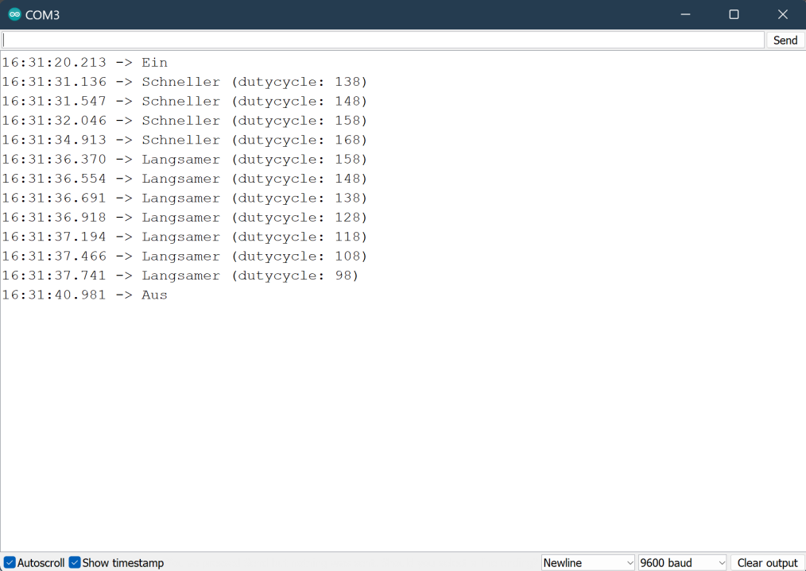{width="5.072222222222222in"
> height="3.595832239720035in"}

*Abbildung 28: UART-Ausgabe des Arduino während der
Geschwindigkeitsanpassung*

Konklusion:\
Es wurde ein Leslie Speaker realisiert, der Passiv sowie Aktiv betrieben
werden kann. Der Verstärker im Lautsprecher hat eine maximale
Ausgangsleistung von 20W. Der Motor des Lautsprechers kann Mit einem
externen Fußschalter gesteuert werden. Im Projekt wurden
Elektrotechnische-, Softwaretechnische- und Mechanische Elemente verbaut
und entwickelt.

Erweiterungsmöglichkeiten wären zum Beispiel ein Bluetooth Modul, um
Wireless Musik abspielen zu können, Verzierung des Gehäuses, Rollen auf
der Unterseite des Gehäuses, neuer Adapter zwischen Rotor und
Klangführung für stabilere Anwendung.

> {width="2.7777777777777777in"
> height="0.3055555555555556in"} 21
